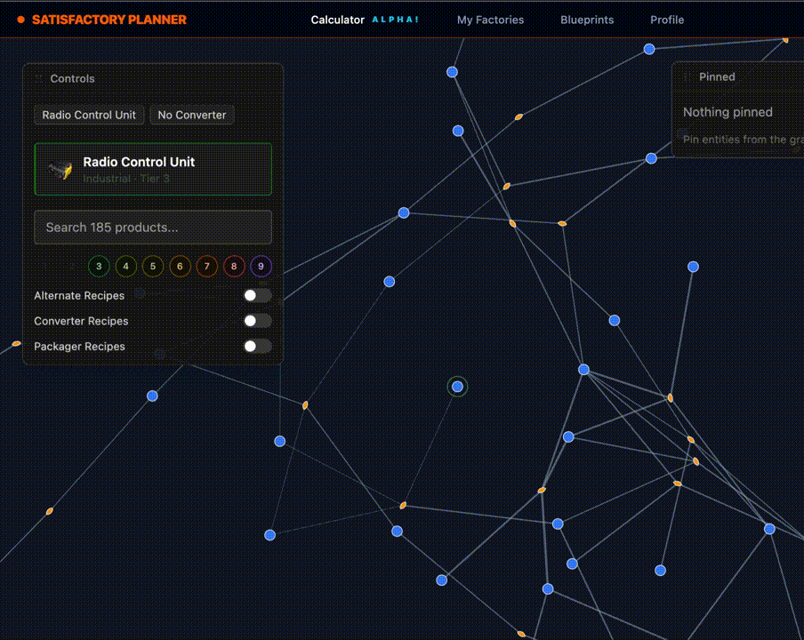

# Satisfactory Factory Planner

> Plan smarter! See everything!

An interactive production chain visualizer for [Satisfactory](https://www.satisfactorygame.com/). Most tools pick the "optimal" path for you and hide the rest. This one does the opposite: it shows **every valid recipe combination** as an explorable graph — alternates, converter recipes, circular dependencies and all — so _you_ decide how to build your factory instead of deferring to someone else's idea of optimal.

**[🔗 Live Demo](https://main.dmlpkp500ruhd.amplifyapp.com/)**

<p align="center">
  
</p>

---

## ✨ What It Does

- **Explore, don't optimize** — there's no single "right" factory. Browse every valid production path for any product, including alternate recipes and circular dependencies, and make the call yourself.
- **Interactive graph visualization** — D3 force-directed graphs with zoom, pan, and drag.
- **Filter-driven subgraphs** — constrain by tier, alternate recipes, converter recipes, and base resources to carve out exactly the production paths relevant to your build.
- **Structure made visible** — every filtered view is re-analyzed for persistence and cycle membership, so the graph reflects what actually matters _in the slice you're looking at_. (More on this below — it's where the active work is.)

---

## Tech Stack

|                   |                                                                 |
| ----------------- | --------------------------------------------------------------- |
| **Frontend**      | React 19 · TypeScript · React Router v7                         |
| **Visualization** | D3.js (force-directed, custom layout)                           |
| **Styling**       | Tailwind CSS v4                                                 |
| **Build**         | Vite (Rolldown)                                                 |
| **Infra**         | AWS — Amplify (deploy) · S3 (source data) · CloudFront (assets) |
| **Data**          | Parsed from Satisfactory game files at build time               |

---

## 🚀 Getting Started

### Prerequisites

- Node.js 18+
- npm

### Setup

```bash
git clone https://github.com/kurthoefer/Satisfactory-optimization-tool.git
cd Satisfactory-optimization-tool
npm install
```

### Development

```bash
npm run dev
```

### Build

```bash
npm run build
```

This runs the full pipeline: game data parsing → TypeScript compilation → Vite build.

### Rebuild Game Data Only

```bash
npm run data:build
```

Parses `_Docs.json` (Unreal Engine export) into the static JSON files the app consumes at runtime.

---

## How It Works

### Data Pipeline

The app parses Satisfactory's raw game data (`_Docs.json`) into three clean datasets at build time:

- **products-flat.json** — craftable products across 16 categories
- **recipes.json** — recipes including alternates and converter recipes
- **topology.json** — a bipartite directed graph encoding every ingredient→recipe and recipe→product relationship, with a global SCC grouping and PageRank persistence baseline

At runtime, `indexes.ts` builds fast lookup maps from this data — no async fetching, no backend calls.

### Static-Runtime Architecture

The app makes a deliberate trade: push _all_ the heavy complexity to build time and the CDN, so the runtime stays simple.

- **Source data lives in S3.** Satisfactory's raw `_Docs.json` (an Unreal Engine export) is stored in S3 and pulled in by the build pipeline, which parses it into the three clean static datasets above.
- **Game assets are served via CloudFront.** Item icons are delivered through a CloudFront distribution rather than bundled or fetched from an app server.
- **The runtime has no server.** The deployed app makes zero API calls at request time. On load, `indexes.ts` builds its lookup maps client-side from the static JSON — no async fetching, no database, no round-trips.

The result: parsing and the _global_ graph precompute happen before deploy, the CDN serves the static JSON and icons, and the graph analysis that still runs at request time — recomputing persistence and SCCs for each filtered subgraph (see [Structure & Storytelling](#structure--storytelling)) — runs **client-side in the browser**. Complexity lives at build time and on the CDN; what's left at runtime is light and serverless.

### The Graph Model

Production chains are modeled as a **bipartite directed graph**:

```
Product → Recipe → Product → Recipe → ...
```

Products and recipes are both nodes. Edges represent material flow. This preserves the full semantics of how recipes _transform_ inputs into outputs, rather than collapsing recipes into simple edges between products.

### State Architecture

The visualization page coordinates three independent state systems, each with a single clear authority:

- **Config** — the URL is the source of truth. Target product and all filters live in search params, so every view is shareable, bookmarkable, and reconstructible from the address bar alone.
- **Session** — a branching history tree with real browser back/forward support. Re-rooting the graph or changing filters extends the tree rather than destroying state, so exploration is non-destructive and reversible.
- **Attention** — a pinned set of entities that persists across re-rooting. What you pin stays with you even as the graph beneath it changes.

Each tier owns its own concern, and data flows one way between them — no tier reaches back into another's state.

### Structure & Storytelling

Every filtered subgraph is re-analyzed on the fly: persistence (PageRank) and cycle membership (SCC) are recomputed for the specific paths in view, rather than reusing the global scores baked into the dataset. That gives a mathematically honest picture of how important each node is _within the slice you're actually looking at_.

The open problem — and the current focus — is **expression**: turning that computed structure into encoding a person can read at a glance. The pinned attention system is the bridge. Structural math says what's important to the _graph_; pinning says what's important to _you_; the goal is a view that holds both at once.

### Data Flow

The visualization page runs a unidirectional pipeline driven entirely by the URL:

```
URL params → TraversalRules → filter edges → BFS upstream walk → subgraph analysis → graph assembly → D3 rendering
```

Selecting a target product and applying filters filters the edges by the current rules, walks upstream via BFS to find the reachable subgraph, recomputes persistence and SCCs on that subgraph, and assembles the result for D3. Because the URL is the single source of truth, every filter and selection is shareable and bookmarkable.

---

## 📋 Roadmap

**Graph & data foundations**

- [x] Bipartite graph construction from game data
- [x] SCC detection (Tarjan's algorithm)
- [x] BFS upstream traversal
- [x] Filter-driven subgraph pipeline (tier, alternates, converter, base resources)
- [x] Per-subgraph persistence (PageRank) and SCC recomputation
- [x] Static-runtime architecture (build-time parse, S3 source, CloudFront assets)

**UI & state**

- [x] Product search with keyboard navigation
- [x] Force-directed graph visualization
- [x] URL-as-source-of-truth config layer
- [x] Branching session history with browser back/forward
- [x] Floating-window system (z-order, draggable surfaces)
- [x] Keyboard-navigable product selector
- [x] Lazy image loading
- [x] Pinned-entity attention set, persistent across re-rooting

**Next**

- [ ] Visual encoding of structure — persistence-driven opacity, SCC coloring, tier color encoding
- [ ] Pinned-driven storytelling (bridge structural math to user attention)
- [ ] Mobile / navigation redesign

**Future**

- [ ] WebGL rendering via Three.js, driven by the existing D3 force simulation
- [ ] Production rate calculator (items/min)
- [ ] User accounts & saved factory blueprints

---

## 📄 License

[MIT](LICENSE)

This project is not affiliated with Coffee Stain Studios. Satisfactory is a registered trademark of Coffee Stain Studios AB.

---

<p align="center">
  Built with ☕ and way too many hours in-game
</p>
